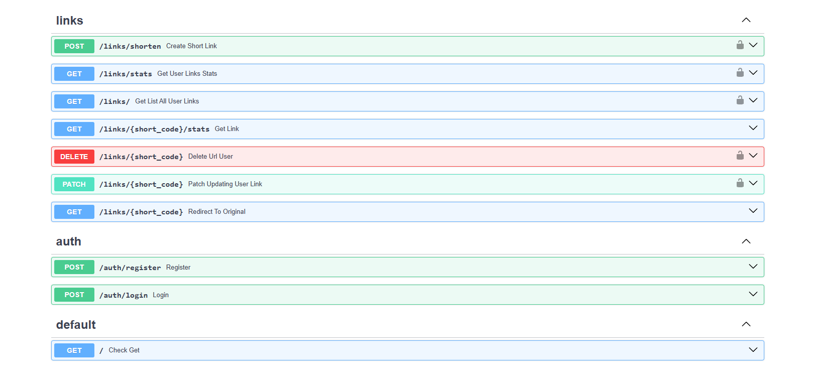

# 🔗 ShortLink — Сервис сокращения ссылок

[](https://python.org)
[](https://fastapi.tiangolo.com)
[](https://sqlalchemy.org)

API-сервис для сокращения ссылок с аутентификацией, статистикой и автоматическим истечением срока действия.

### CI/CD Status

[](https://github.com/say-boop/shortlink/actions)

## 📸 Скриншоты



## 🚀 Функционал

- ✅ Регистрация и вход (JWT токены)
- ✅ Создание коротких ссылок
- ✅ Редирект с подсчетом кликов
- ✅ Статистика по каждой ссылке
- ✅ Личный кабинет (список ссылок пользователя)
- ✅ Поиск, фильтрация и сортировка ссылок
- ✅ Удаление и редактирование ссылок
- ✅ Срок действия ссылок (авто-истечение)
- ✅ Проверка дубликатов URL
- ✅ Общая статистика пользователя
- ✅ Логирование действий
- ✅ Redis кэширование (ускорение редиректов)
- ✅ Rate Limiting (ограниечение запросов)
- ✅ Docker (контейнеризация)
- ✅ Смена пароля

## 🛠 Технологии

| Технология | Назначение |
|------------|------------|
| FastAPI | Веб-фреймворк |
| SQLAlchemy | ORM для работы с БД |
| SQLite | Запасная база данных |
| Alembic | Миграции БД |
| Pydantic | Валидация данных |
| Passlib + Argon2 | Хеширование паролей |
| JWT (python-jose) | Аутентификация |
| Pytest | Тестирование |
| Poetry | Управление зависимостями |
| Redis | Кэширование ссылок |
| SlowAPI | Rate Limiting |
| Docker | Контейнеризация |
| PostgreSQL | Основная база данных

## 📦 Установка и запуск

### Требования

- Python 3.12+
- Poetry

### Установка

```bash
# Клонировать репозиторий
git clone https://github.com/say-boop/ShortLink
cd shortlink

# Установить зависимости
poetry install

# Применить миграции
poetry run alembic upgrade head

# Запуск через Docker
docker-compose up --build

# Запустить сервер
poetry run uvicorn app.main:app --reload

```

## Доступ

Сервер будет доступен по адресу: https://127.0.0.1:8000

Документация API: https://127.0.0.1:8000/docs

## Тесты

```bash
# Запуск теста
poetry run pytest -v
```

## 📡 API Эндпоинты

### Аутенфикация

| Метод | Путь | Доступ | Описание |
|-------|------|--------|----------|
| POST | /auth/register | Публичный | Регистрация |
| POST | /auth/login | Публичный | Вход → JWT токен |

### Ссылки

| Метод | Путь | Доступ | Описание |
|-------|------|--------|----------|
| POST | /links/shorten | 🔒 | Создать ссылку |
| GET | /links/ | 🔒 | Список ссылок (с поиском и сортировкой) |
| GET | /links/stats | 🔒 | Общая статистика |
| GET | /{short_code} | Публичный | Редирект |
| GET | /{short_code}/stats | Публичный | Статистика по ссылке |
| PATCH | /{short_code} | 🔒 | Обновить URL |
| DELETE | /{short_code} | 🔒 | Удалить ссылку |
| PATCH | /auth/change-password | 🔒 | Смена пароля |

### Параметры для GET /links/

| Параметр | Тип | По умолчанию | Описание |
|----------|-----|--------------|----------|
| search | string | - | Поиск по URL |
| order_by | string | created_at | Поле сортировки (clicks, created_at) |
| order_dir | string | desc | Направление (asc, desc) |
| skip | int | 0 | Пропустить записей |
| limit | int | 10 | Записей на страницу |

### Состояние сервера

| Метод | Путь | Доступ | Описание |
|-------|------|--------|----------|
| GET | /health | Публичный | Проверка состояния сервера |

## 📁 Структура проекта

``` text
shortlink/
├── app/
│   ├── main.py              # Точка входа
│   ├── config.py            # Настройки
│   ├── database.py          # Подключение к БД
│   ├── dependencies.py      # Зависимости (get_current_user)
│   ├── logging_config.py    # Логирование
│   ├── models/              # SQLAlchemy модели
│   ├── schemas/             # Pydantic схемы
│   ├── routers/             # API эндпоинты
│   ├── services/            # Бизнес-логика
|   └── cache/               # Redis кэширование
├── migrations/              # Alembic миграции
├── tests/                   # Тесты
├── docker-compose.yml       # Docker (FastAPI + Redis + PostgreSQL)
├── Dockerfile               # Инструкция сборки
├── .dockerignore            # Исключения для Docker
├── .env                     # Переменные окружения
├── alembic.ini              # Настройки Alembic
├── pyproject.toml           # Зависимости Poetry
└── README.md                # Ты здесь! 😊
```

